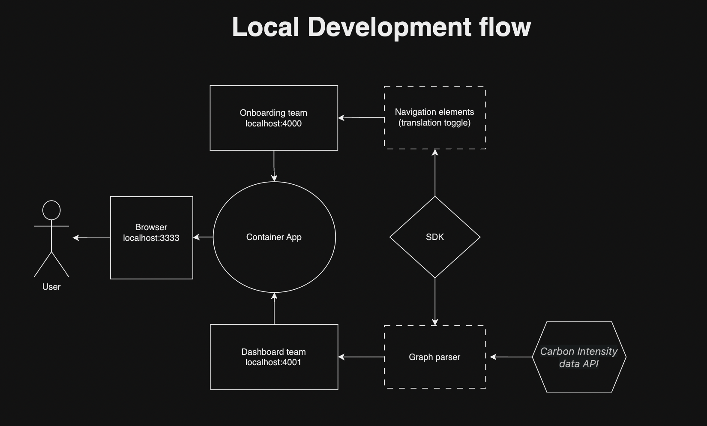

# Architecture Overview

This app is built as a micro-frontend using [webpack ModuleFederation Plugin](https://webpack.js.org/plugins/module-federation-plugin/). Each of the team's fragments are run on separate servers, for development these are different ports on localhost. The container app is told where to look for remote components and they are added exactly as if they were local.

It has a container app and (currently) 2 teams working within it.

- Onboarding team
  - Login
  - Navigation
  - Translation
- Dashboard team
  - Chart pages
    - grabs data from the carbon intensity data api

Each [team folder](https://github.com/mousemke/special-happiness/tree/main/teams) has it's own build pipeline, (currently just webpack dev server since it is not hosted anywhere) so each team can build whatever they need, test, and deploy autonomously. Team servers are capable of exporting entire pages as well as smaller components to be consumed elsewhere. There is no limit to the amount of external teams that can be added.

Although right now, we are consuming from other areas of the monorepo, that is not a constraint of the technology and should be decide to split the monorepo or use both mono repo and smaller repos, we can do that.
